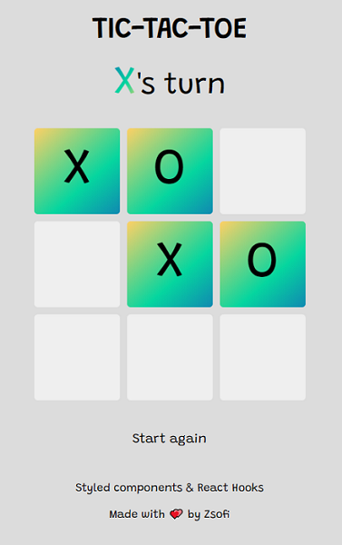

# Tic-tac-toe
A classic game - a little project to learn about Styled Components, practice React Hooks and testing.



### Tech stack
* React Hooks
* Styled Components
* Jest
* Enzyme
* ESLint
* Travis CI

### How to use locally:

* Clone this repo and navigate to the local folder
* Install all dependencies by typing in the terminal:
```
npm install
```
* To run the app, type in the terminal:
```
npm start
```
* Play!

### How to run tests: 
* Navigate to the local folder
* To run the tests, type in the terminal: 
```
npm test
```
